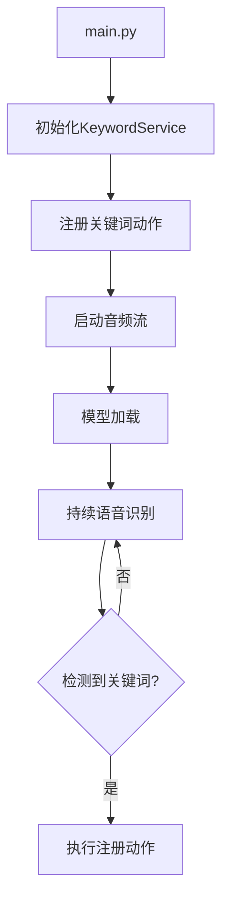

### 项目结构图

```text
D:\DOCUMENT\PYTHON\KWS/
├── kws/                  # 核心功能模块
│   ├── audio.py          # 音频流处理模块（音频采集/队列管理）
│   ├── model_manager.py  # 模型管理模块（下载/校验/解压）
│   ├── service.py        # 关键词检测服务（注册动作/运行循环）
│   └── config.py         # 配置文件（音频设备参数等）
├── data/                 # 数据存储目录
│   ├── model/            # Vosk语音识别模型
│   │   ├── am/           # 声学模型
│   │   ├── graph/        # 解码图
│   │   └── ivector/      # i-vector 特征
├── main.py               # 程序入口（服务初始化/动作注册）
├── uv.lock               # Python依赖锁定文件
└── .gitignore            # Git忽略规则
```

### 主要模块说明

1. **音频处理模块** 
   
   - 使用 `sounddevice` 库实现实时音频流捕获
   - 采用生产者-消费者模式（队列管理音频数据）
   - 支持多线程处理音频数据
   
2. **模型管理模块** 
   
   - 自动下载 Vosk 中文语音识别模型（约 40MB）
   - 模型完整性校验（检查必要文件是否存在）
   - 解压和部署模型到指定目录
   
3. **核心服务模块** 
   - 关键词动作注册机制
   - 持续监听音频输入
   - 日志管理（自动轮转和清理）

4. **数据目录结构：
   ```bash
   # 模型目录结构
   data/model/
   ├── am/              # 声学模型参数
   ├── conf/            # 模型配置文件 
   ├── graph/           # 解码图（包含 phones/ 等子目录）
   └── ivector/         # 全局CMVN统计量
   ```

### 工作流程


需要更详细的某个模块说明可以告诉我，我可以针对特定文件或类进行展开解释。